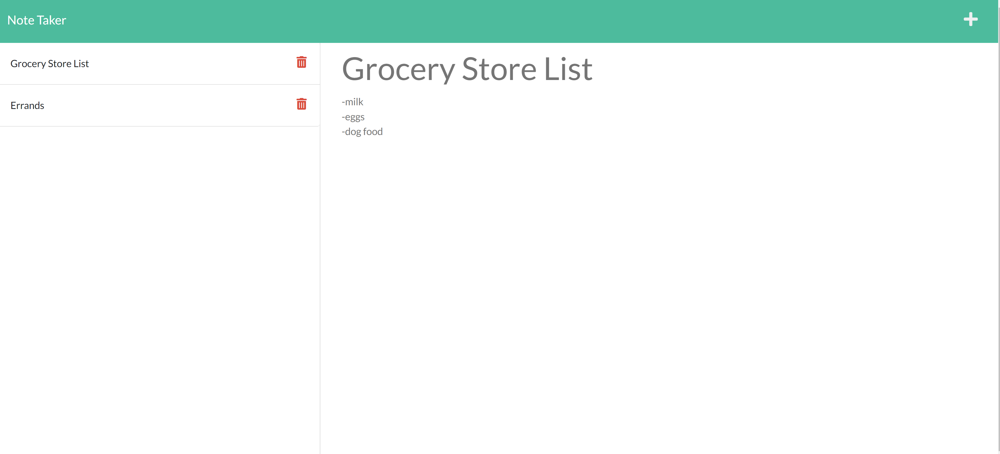

## note-taker

# Project Summary

For this project we were given starter code for the front end,  I had to create the back end of a Note Taker that can save, retrieve, and delete files from a JSON file that stores our data.  The application was run using Node.js and a web framework called Express to help handle route reqests.  I also utilized and required uuid, fs, and path mods. I created the neccsary routes on the back end to handle the api calls from the starter code to create, save, and delete notes.  

https://github.com/ChrisDuhaime/note-taker

https://damp-retreat-25791.herokuapp.com/

